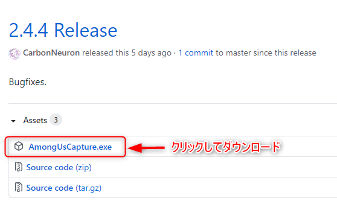

# AutoMuteUs 導入手順
AmongUsとDiscordを連携し、AmongUsのゲーム状況（タスク中/会議中/死亡後）に応じてDiscordを自動でミュートする[AutoMuteUs](https://github.com/denverquane/automuteus)の導入手順です。  
実行できるまでの最短・最小手順のみを記述しているため、トラブルシューティングはありません。  
AutoMuteUsの詳しい操作については[AutoMuteUs](https://github.com/denverquane/automuteus)のReadMeを参照してください。  

<!-- TOC depthFrom:2 -->

- [1. AutoMuteUsのインストール(初回のみ)](#1-automuteusのインストール初回のみ)
- [2. AmongUsCaptureのインストール(ゲームのホストユーザーのみ。初回のみ)](#2-amonguscaptureのインストールゲームのホストユーザーのみ初回のみ)
- [3. 使用方法](#3-使用方法)
    - [3.1. ホストの操作](#31-ホストの操作)
    - [3.2. ゲストの操作](#32-ゲストの操作)
- [4. ゲームの設定を変更したい場合](#4-ゲームの設定を変更したい場合)
- [5. 終了方法](#5-終了方法)

<!-- /TOC -->
## 1. AutoMuteUsのインストール(初回のみ)
1. [AutoMuteUs](https://github.com/denverquane/automuteus)にアクセス  
1. GIF画像をクリック  
  
1. DiscordサーバーにAutoMuteUsインストールする  
  
  
1. Discordのユーザー設定からDMを許可する  
  

## 2. AmongUsCaptureのインストール(ゲームのホストユーザーのみ。初回のみ)
DiscordとAmongUsを連携するアプリケーション  
1. [AmongUsCapture](https://github.com/denverquane/amonguscapture/releases/tag/2.4.4)にアクセス  
1. AmongUsCapture.exeを任意の場所にダウンロード  
  
1. 実行してインストール(Windowsの警告が出るので許可する)  
**インストール後はAmongUsCapture.exeの場所を移動させない**  
  
  

## 3. 使用方法
### 3.1. ホストの操作
AmongUsCaptureが起動している場合は終了させておく  
1. AmongUsで部屋を作成する  
1. Discordのチャットで`.au new`を入力する  
  
Main Menuが表示される  
  
1. AutoMuteUsからDMが届くのでリンクをクリックする    
  
  
1. AmongUsCaptureが実行され、Main Menuの表示が変わる  
自分のキャラクターの色のアイコンをクリックする  
  
1. Unlinkedが自分の名前になれば成功  
  

### 3.2. ゲストの操作
ルームコードでゲームに参加し、自分の色のアイコンをクリック  
  

以上で設定は終了。  
ゲームを始めると自動でマイク・スピーカーがミュートになり、会議が始まるとミュートが解除されます。  

## 4. ゲームの設定を変更したい場合
マップやインポスターの数を変えたい場合の手順  
1. ホストプレイヤーがルームを解体する  
1. ルームの設定を変更してルームを作成する  
1. Discordのチャットで`.au refresh`を入力する  
1. DiscordのMain Menuが更新される  
1. アイコンをクリックする  

## 5. 終了方法
1. Discordのチャットで`.au end`を入力  
1. AmongUsCaptureを手動で終了させる  